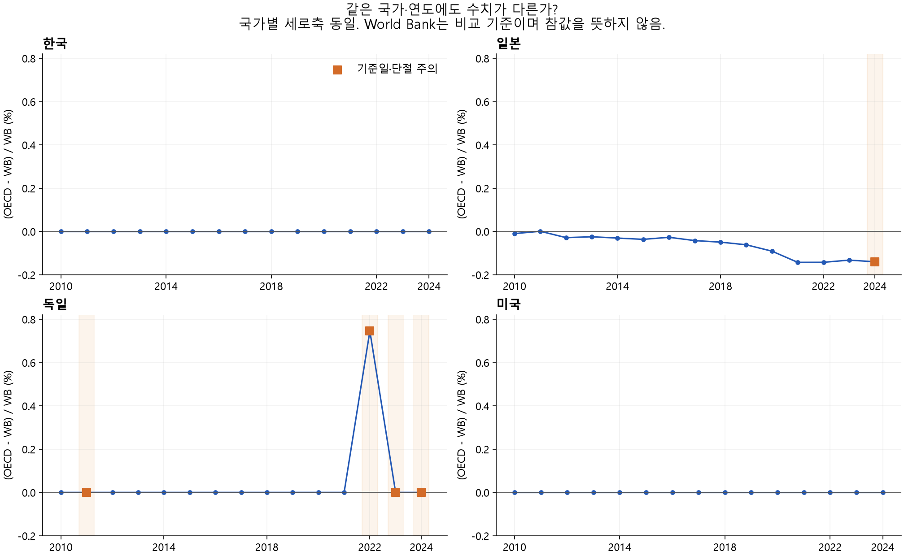
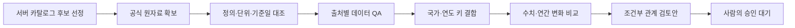

# 공공데이터 온톨로지 분석 과정

공공데이터 포털의 등록정보를 비교하고, 같은 개념으로 연결한 자료의 **실제 관측값까지 검증하는 과정**을 기록한 저장소입니다.

기존 온톨로지 프로젝트에서 분석 부분만 별도로 구성했습니다. 서버 원본 DB와 인증정보는 포함하지 않습니다. 분석 시점은 2026년 9월 15일이며, 관계 확정은 사람의 검토를 기다립니다.

## 먼저 볼 자료

| 읽을 내용 | 설명 보고서 | 그래프·필터 화면 |
|---|---|---|
| 실제 인구 관측값 비교와 분석 과정 | [관측값 분석 보고서](analysis/observation-comparison/20260915/REPORT.md) | [HTML 파일](analysis/observation-comparison/20260915/index.html) |
| 국내외 포털의 등록정보·메타데이터 비교 | [포털 비교 보고서](analysis/server-catalog/20260915/REPORT.md) | [HTML 파일](analysis/server-catalog/20260915/index.html) |

GitHub에서는 설명 보고서를 바로 읽을 수 있습니다. HTML은 저장소를 내려받아 파일을 열면 그래프와 국가별 필터가 동작합니다. 이 저장소에는 웹 배포를 설정하지 않았습니다.

## 분석 범위와 결과

**1단계 — 서버 카탈로그 분석:** 40개 등록 출처의 등록정보 3,815,931건을 읽었습니다. 저장된 중복 표시 110,581건을 제외한 3,705,350건으로 항목 기재율·분류·연결 단서를 비교했습니다. 이는 전 세계 고유 데이터셋 수나 실제 관측값 수가 아닙니다.

**2단계 — 실제 관측값 분석:** 서버의 공식 접근 경로를 출발점으로 OECD와 World Bank의 한국·일본·독일·미국 총인구를 내려받았습니다. 2010~2024년 기관별 60개, 총 120개 관측값을 국가·연도별 60쌍으로 비교했습니다.

| 국가 | 두 출처를 비교한 결과 |
|---|---|
| 한국·미국 | 선택한 15년의 수치가 모두 일치 |
| 일본 | 평균 절대 차이율 약 0.064% |
| 독일 | 2022년 620,174명 차이. 2022·2023년은 연간 증감 방향도 다름 |

같은 주제로 연결할 수 있어도 그대로 대체 가능한 것은 아닙니다. 통계 단절·기준일·개정·상위 출처를 확인해야 합니다. 일부 수치 일치는 독립적인 두 조사에 의한 정확성 검증을 뜻하지 않습니다.



## 전체 과정



- [단계별 상태와 증거](analysis/observation-comparison/20260915/process.json)
- [국가·연도별 실제 값과 차이](analysis/observation-comparison/20260915/paired-observations.json)
- [출처별 QA](analysis/observation-comparison/20260915/qa.json)
- [온톨로지 관계 검토안](analysis/observation-comparison/20260915/relationship-review.json)
- [사이트 유형별 QA 기준 초안](analysis/server-catalog/qa-policy.json)

기준일·단절 주의 항목 5쌍을 제외한 55쌍도 별도로 비교했습니다. 원자료는 보존했고, 빠진 연도를 건너뛰어 1년 변화로 계산하지 않았습니다. `sameAs`나 인과관계를 승인하지 않았으며 서버 DB와 기존 `model.json`을 수정하지 않았습니다.

## 내 컴퓨터에서 보기

```bash
git clone --branch codex/analysis-process-20260916 https://github.com/chlsuun/public-data-ontology-analysis.git
cd public-data-ontology-analysis
```

`analysis/observation-comparison/20260915/index.html`을 브라우저에서 여세요. 핵심 데이터와 그래프가 HTML에 포함돼 있어 네트워크 없이 볼 수 있습니다. 근거 파일 링크까지 유지하려면 날짜 폴더 전체를 함께 보관하세요.

비공개 저장소에서는 접근 권한이 있는 GitHub 계정으로 인증해야 합니다.

## 재현과 검증

Python 3.12 이상과 Node.js 22 이상을 사용합니다. 보존된 원응답을 사용한 수치 재계산에는 서버 접속이나 API 키가 필요하지 않습니다.

```bash
python -m venv .venv
# Windows PowerShell: .venv\Scripts\Activate.ps1
# macOS/Linux: source .venv/bin/activate
python -m pip install -r requirements.txt
python scripts/analyze_observation_comparison.py
python scripts/render_observation_comparison.py
python scripts/test_observation_comparison.py
python scripts/test_server_catalog_analysis.py
node scripts/check_observation_report.mjs
node scripts/check_server_catalog_report.mjs analysis/server-catalog/20260915/index.html
```

재계산하면 로컬 결과 파일의 생성·검증 시각이 바뀔 수 있습니다. 보존된 관측값과 분석 기준은 파일에서 확인할 수 있습니다.

- [계산 검증 결과](analysis/observation-comparison/20260915/validation.json): 원응답 대조, 단위 환산, 중복 거부, 연속 연도 조건, 메타데이터 셀 확인.
- [화면 코드 검증 결과](analysis/observation-comparison/20260915/ui-validation.json): 오프라인 DOM 검사. 국가·주의 항목 필터, 내보내기, 근거 링크를 확인했습니다.
- 그래프 PNG 3종은 확인했습니다. 도구의 로컬 URL 정책 때문에 실제 브라우저 레이아웃 자동 검증은 완료하지 못했습니다.

서버 카탈로그 전수 집계를 다시 실행하려면 별도의 서버 접근 권한과 같은 스키마의 원본 DB가 필요합니다. 저장소에 포함된 집계 JSON으로 보고서를 다시 만드는 작업은 서버 없이 가능합니다.

```bash
python scripts/render_server_catalog_analysis.py analysis/server-catalog/20260915/report.json
```

## 저장소 구성과 출처

- `analysis/server-catalog/`: 전체 등록정보의 집계·설명·QA 초안.
- `analysis/observation-comparison/`: 원관측값·정규화·비교·그림·검토안.
- `scripts/`: 수집 기록, 분석, 렌더링, 검증 코드.
- `provenance/source-files.json`: 기존 프로젝트에서 가져온 분석 파일의 경로·크기·원본 해시.

공식 응답의 URL·수집 시각·HTTP 응답·SHA-256은 `raw/*.receipt.json`에 기록했습니다. 원자료의 이용조건은 각 출처를 따르며, 이 저장소가 제3자 자료에 새로운 라이선스를 부여하지 않습니다. 소스 코드의 별도 오픈소스 라이선스는 아직 지정하지 않았습니다.
